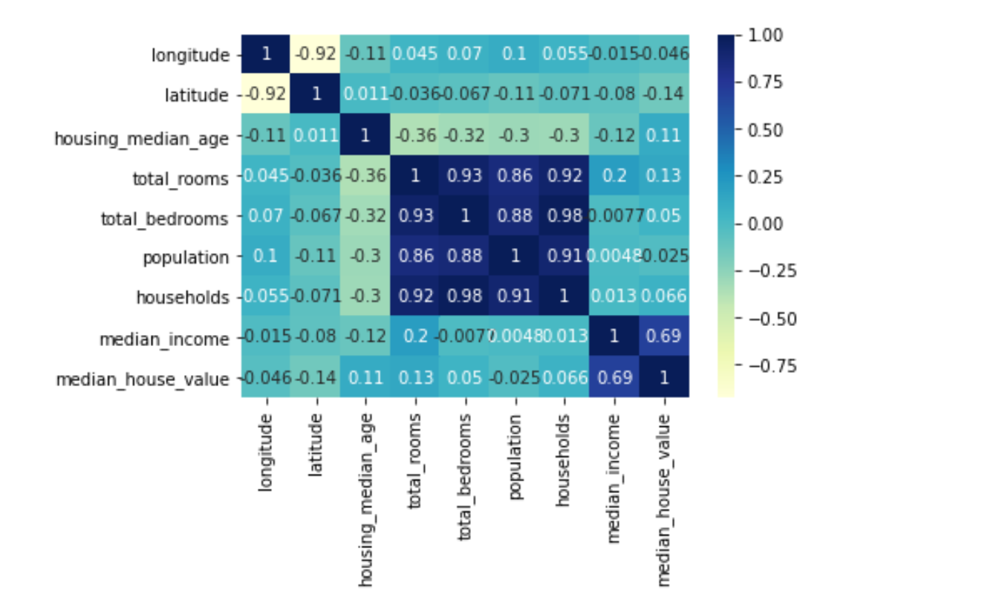

# Predicting Median Home Price Using Machine Learning

Abstract: Estimating the current value of an asset has been an age old issue due to disparity of information, yet the profits one could achieve if they could make such accurate predictions would be unfathomable. So, it follows that tools that can give even a close estimation of current market value have extreme utility to users of all kinds ranging from buyers to speculators to underwriters. To that end, using California housing census data, my model has been able to give predictions on median home value with a high degree of accuracy while identifying key features that contribute to value .
## Business Understanding
No one ever wants to overpay or feel like they got ripped off. Therefore, real estate developers, investors and mortage underwriters have had to dedicated significant time and resources to trying to determine the fair market value of a property before pulling the trigger and investing capital. In pursuing this project, I aim to address this issue by building an accurate model that can give these parties a competitive advantage by being able to generate a fair market value much faster and thus make decisions faster. 

According to Realtor.com(https://www.realtor.com/advice/finance/how-long-does-it-take-to-get-a-mortgage/#:~:text=The%20entire%20mortgage%20process%20has%20several%20parts%2C%20including,45%20to%2060%20days%2C%20depending%20on%20the%20lender) the average mortage process takes about 30 days. This delay means customers have time to shop around and find a better rate or possibly for the home to sell and both the underwriter and the buyer to lose out. By incorporating a model that can accurately churn out fair market value, an underwriter will be able to complete their due diligence far faster and thus close the mortage before losing the customer or the underlying house. The same issue of time appears under numerous business use cases with time quite literally costing these stakeholders money. Besides time, firms can also gain competitive advantage from this type of model by being able to derive insights into what drives value. Knowing the value is a great insight but knowing how many bedrooms to add or how far your development should be from the ocean are also extremely valueable insights. Consumers also have a vested interest in knowing fair market value as to be able to make an informed decision when purchasing a home. 

## Data Understanding 

The dataset I chose to use for this model is a California Housing dataset derived from US Census data. A large factor is the data is done on a larger scale basis because of its nature as Census data. Instead of looking at individuals homes and associated features, this dataset uses districts so that each entry is representative of a large amount of homes. So, when delivering any insights or predicting any home values, it is important to keep these factors in mind. 

The dataset is in CSV format, so I began by importing the data as a Pandas dataframe to make analysis and exploration easier. Just looking at the data, I already could form an inference that certain features like median income would have a large impact on median home value. To explore this inference, I created a correlation matrix to check all the correlations between features. Then before proceeding, I completed my train test split and would perform any further changes to both sets.

Seeing this correlation matrix confirmed a few of my inferences while peaking my interest as to why longitude and latitude did not have such a strong effect. Also, I saw that the feature "distance to ocean" was not represented because of its nature as a string so that led me to using one hot encoding to have this feature more easily represented. 

Having added these features, it was easy to see their value as it seemed to indicate that the closer to the ocean, the higher the value. After this feature engineering, I decided to dig into the data a bit more using a histogram. By doing this I was able to see the skew of the data, and with this skew, I knew it would affect any model I made. Therefore, I decided to apply a log transformation to normalize. 
